# P2_Probstat_A_5025201075

## Nomor 1
### a
Pada nomor 1a kita diminta untuk menampilkan standar deviasi dari data selisih pasangan pada tabel yang diberikan. Berikut merupakan potongan program untuk mendapatkan standar deviasi yang dimaksudkan
    
    stDeviasi = sd(data.frame(data1)$x-data.frame(data1)$y)
    stDeviasi
    
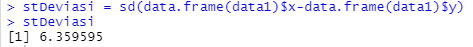
 
### b 
Berikutnya kita diminta untuk mencari nilai t(p-value), dapat dilakukan dengan cara sebagai berikut
  
    dBar = sum(data.frame(data1)$y-data.frame(data1)$x) / n
    t = dBar / stDeviasi
    pValue = 2 * pt(-abs(t), df = n - 1)
    pValue
    
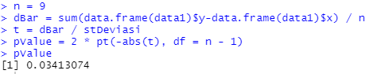

Dengan t sebagai thitung yang nantinya akan digunakan untuk mendapatkan nilai p-value dari distribusi t

### c
Berikutnya kita diminta untuk menenntukan apakah terdapat pengaruh yang signifikan secara statistika
dalam hal kadar saturasi oksigen , sebelum dan sesudah melakukan
aktivitas 𝐴 jika diketahui tingkat signifikansi 𝛼 = 5% serta H0 : “tidak ada
pengaruh yang signifikan secara statistika dalam hal kadar saturasi
oksigen , sebelum dan sesudah melakukan aktivitas 𝐴”.

Untuk dapat melihat pengaruh jika terdapat tingkat signifikasi 5% dan tidak ada pengaruh yang signifikan secara statistika, maka kita bisa melakukan hal berikut.

    install.packages("BSDA")
    library(BSDA)
    t.test((data.frame(data1)$x-data.frame(data1)$y), alternative = 'two.sided', var.equal = TRUE)
    
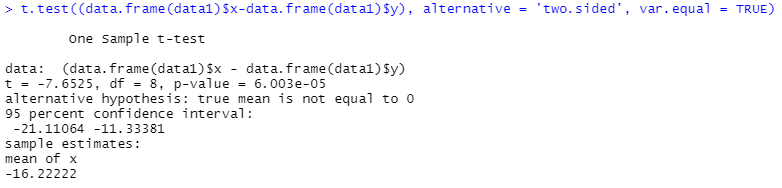

Dan didapatkanlah p-value < H0  yang berarti H0 ditolak. yang berarti bahwa tidak terdapat pengaruh yang signifikan

## Nomor 2
### a 
setuju

### b
Untuk nomor ini kita diminta untuk menjelaskan output yang dihasilkan bedasarkan perhitungan yang telah dilakukan sebagai berikut

    tsum.test(mean.x=23500, sd(3900), n.x=100, var.equal = TRUE)

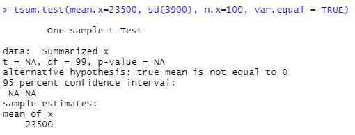

Dengan diketahui banyaknya sampel, rata-rata dan standar deviasi, maka bisa kita dapatkan untuk hipotesis null dan hipotesis alternatif berturut turut adalah μ = 20000 dan μ > 20000

### c
Pada bagian ini kita diminta untuk mengampil kesimpulan bedasarkan p-value yang didapatkan, pertama kita perlu mencari nilai dari z untuk melakukan perhitungan distribusi normal terlebih dahulu dengan potongan program sebagai berikut

    z = (rerata - rata) / (stdev2 / sqrt(n))
    p = dnorm(z)
    p

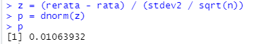

dapat dilihat bahwa nilai dari pnya sangatlah kecil yaitu sebesar 1.294382e-18 yang berarti bahwa mobil yang dikemudikan memiliki rata-rata > 20000 km/tahun

## Nomor 3
### a
Pada nomor ini kita diminta untuk mencari h0 dan h1 dari dataset yang telah diberikan, hal tersebut dapat dilakukan dengan menggunakan potongan program sebagai berikut

    h0 = mBdg / (stdevBdg / sqrt(shmBdg))
    h1 = mBl / (stdevBl / sqrt(shmBl))
    h0
    h1
 
 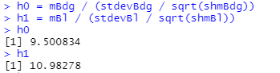
 
dengan H0 : "tidak ada perbedaan rerata antara bandung dan bali", sedangkan untuk H1 : "Terdapat perbedaan rereta antara bandung dan bali" 

### b
Pada bagian ini kita diminta untuk menghitung sampel statistik, dan hal tersebut dapat dilakukan dengan memanggi fungsi `tsum.test()` dengan parameternya bedasarkan data yang telah diberikan pada soal tersebut.

    tsum.test(mean.x = mBdg, s.x = stdevBdg, n.x = shmBdg, mean.y = mBl, s.y = stdevBl, n.y = shmBl, alternative = "greater", var.equal = TRUE)

 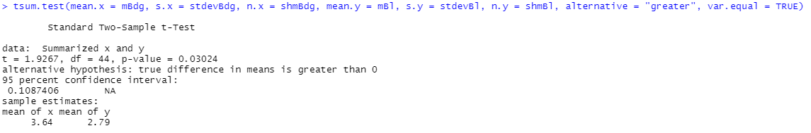

### c 
Pada bagian ini kita diminta untuk melakukan uji statistik (df=2), dan hal tersebut dapat dilakukan dengan menggunakan fungsi `qt()` pada R yang parameternya berisikan peluang dan df=2.

    qt(p = 0.05 / 2, df = 2, lower.tail = FALSE)

 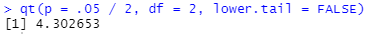

### d 
Untuk mendapatkan nilai kritikal pada dataset yang diberikan kita dapat mendapatkan hal itu dengan menggunakan fungdi `qchisq()`, berikut merupakan potongan program yang dimaksudkan

    qchisq(p = .05 / 2, df = 2, lower.tail = FALSE)

 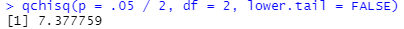

### f
Kesimpulan yang dapat di ambil adalah H0 yaitu "tidak ada perbedaan rerata antara bandung dan bali" dapat diterima

## Nomor 4
### a 
pada soal ini kita diminta untuk menggambarkan plot kuantil normal untuk setiap kelompok dari data yang diberikan pada soal dan lihat apakah ada outlier utama dalam homogenitas varians, dengan potongan program sebagai berikut

    data4$Group = as.factor(data4$Group)
    data4$Group = factor(data4$Group, labels = c("kucing oren", "kucing hitam", "kucing putih"))
    grup1 = subset(data4, Group == "kucing oren")
    grup2 = subset(data4, Group == "kucing hitam")
    grup3 = subset(data4, Group == "kucing putih")
    qqnorm(grup1$Length)
    
   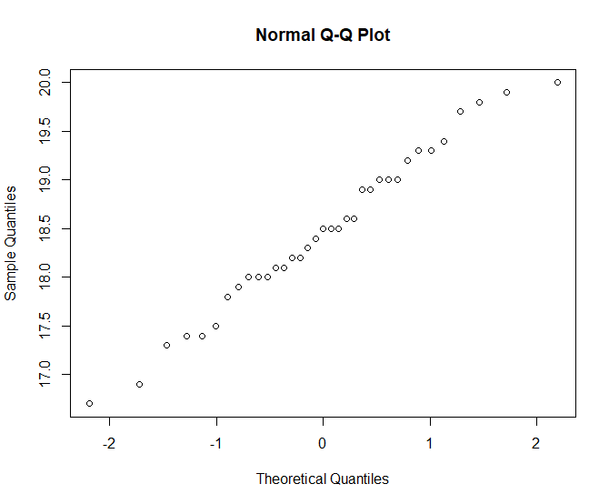
   
    qqnorm(grup2$Length)
    
    
    
    qqnorm(grup3$Length)
    
   
    
### b
Kemudian kita diminta untuk mencari homogeneity of variance, nilai p, hipotesis dan kesimpulan yang didapatkan. Hal tersebut dapat dilakukan dengan potongan program sebagai berikut

    bartlett.test(Length~Group, data = data4)

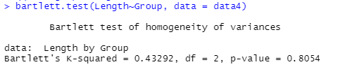

Dengan didapatkannya nilai dari Bartlett's K-squared, dan p yang didapat beserta nilai p lebih dari nilai signifikan maka H0 dapat diterima

### c
Untuk uji ANOVA (satu arah), buatlah model linier dengan Panjang versus Grup dan beri nama model tersebut model 1.

    model1 = aov(Length~Group, data = data4)

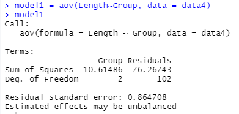

### d
Dengan didapatkannya p sebesar .0013 maka H0 ditolak

### e
Berikut merupakan n Post-hoc test Tukey HSD dengan memanggil fungsi `TukeyHSD()`.

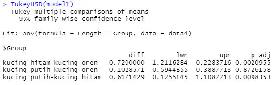

Berdasarkan gambar tersebut grup3-grup1 memiliki p-value lebih dari 0.05, sehingga H0 dapat diterima, sedangkan p-value untuk grup2-grup1 dan grup3-grup2 kurang dari 0.05 sehingga H0 ditolak.

### f
Visualisasi data dengan ggplot2
    
    library("ggplot2")
    ggplot(data4, aes(x = Group, y = Length)) + geom_boxplot(fill = "white", colour = "black") + scale_x_discrete() + xlab("Group") + ylab("Length")

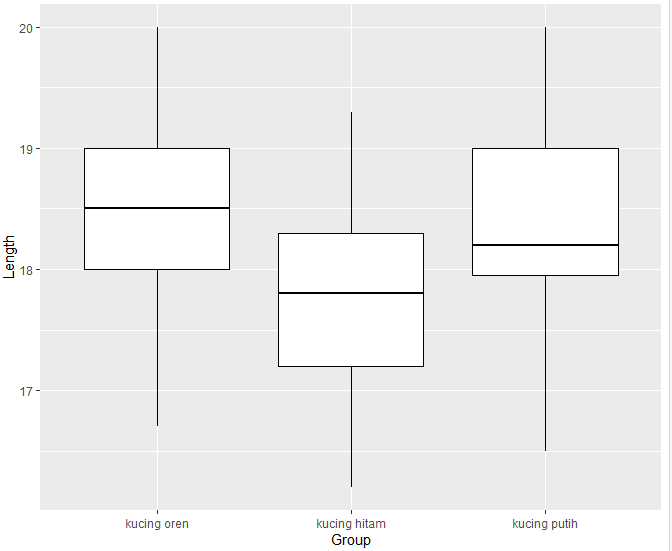

